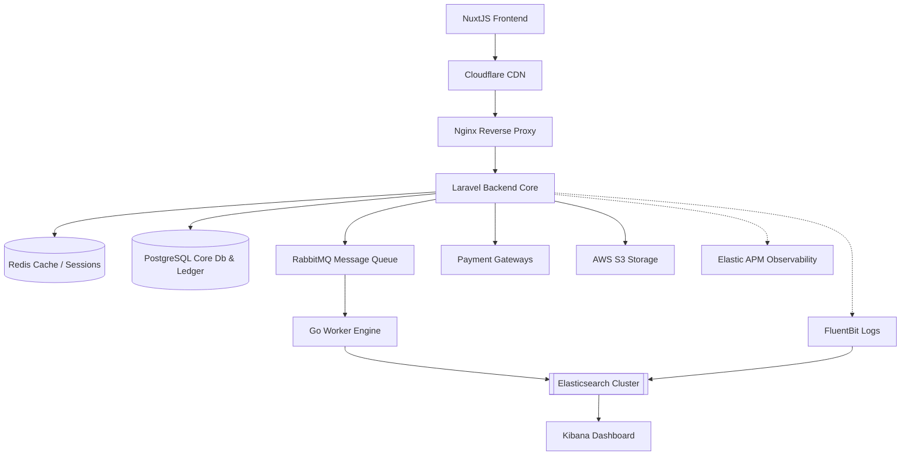

# 🚀 Enterprise E-Commerce System

A production-grade, asynchronous e-commerce platform designed to handle high-volume concurrency, dynamic multi-vendor inventories, and strict transactional data integrity.

---

## 🎯 Core Features & System Engineering

This ecosystem is built to address specific high-scale distribution challenges, leveraging targeted technical strategies for data integrity, concurrency, and performance.

### 🔒 Security & Identity
*   **User Authentication & RBAC:** Secure API token infrastructure utilizing Laravel Sanctum coupled with Spatie Laravel-Permission for strict multi-role enforcement (Customer, Vendor, Driver, Admin).
*   **Vendor & Driver Profiles:** Isolated profile governance handling vendor-specific configurations and asynchronous driver status updates.

### 📦 High-Performance Catalog & Search
*   **Product Category Hierarchy:** An optimized, traversable relational structure designed to handle deep nested catalog taxonomies without database recursion bottlenecks.
*   **Product Indexing Search:** Sub-second full-text searches and complex filtering powered by an isolated **Elasticsearch** cluster.
*   **Million-Row Strategy:** Advanced database indexing, query optimization, and structural design tailored to maintain high-velocity read operations across tables exceeding 1,000,000 rows.

### ⚡ Concurrency & Asynchronous Event Processing
*   **High Volume Concurrency:** Mitigation of race conditions and system bottlenecks during peak traffic via **Redis** connection pooling and memory caching.
*   **Warehouse & Inventory Stock Ledger:** Double-entry style stock tracking preventing inventory overselling during parallel checkout hits.
*   **Asynchronous Processing Pipeline:** High-throughput data syncing where Laravel offloads mutation payloads to **RabbitMQ**, which are immediately processed by parallel, lightweight **Go Routines** for database-to-search indexing.

### 💼 Financial & Logistics Framework
*   **Financial Ledger:** Immutable ledger design capturing every financial state modification to ensure strict accounting auditing and compliance.
*   **Payout Escrow:** Multi-party distribution management holding vendor funds safely until specific platform delivery criteria are verified.
*   **Product Price Track Records:** Historic temporal logging tracking pricing adjustments over time to support analytics and historical user metrics.
*   **Logistics & Shipment Legs:** Multi-stage shipment tracking breaking orders down into discrete transactional legs for real-time delivery tracking.

---

## 🛠️ System Architecture & Tech Stack




---

## 🚀 Engineering Timeline & Process

This project is built using Agile SDLC methodologies, tracked via GitHub Issues, and documented through evolutionary sprint logs detailing technical challenges, database structures, and architectural retrospectives.

*   **[Global Database Schema & Specifications](docs/architecture/01-database-schema.md)**
    *   **Focus:** Segregated entity-relationship blueprints across RBAC, Social Accounts, Products, Warehouse, Inventory, and Shipment sub-domains.
*   **[Sprint 00: Base Infrastructure Monorepo Setup & Bootstrapping (Completed)](docs/sprints/SPRINT-00.md)**
    *   **Focus:** Docker Orchestration (PostgreSQL, Redis, RabbitMQ, Nginx), Monorepo Scaffold, and Pest PHP testing initialization.
*   **[Sprint 01: Core Auth, RBAC & Profile Domains (Completed)](docs/sprints/SPRINT-01.md)**
    *   **Focus:** Laravel Sanctum Token Infrastructure, Spatie RBAC Middleware, multi-dashboard routing, and comprehensive Pest TDD coverage.
*   **[Sprint 02: Product Catalog & Category Hierarchy (Completed)](docs/sprints/SPRINT-02.md)**
    *   **Focus:** Self-referencing category trees, vendor storefront profiles, product variants with SKU management, and PostgreSQL trigger-driven immutable price ledgers.
*   **[Sprint 03: Warehouse Facilities & Inventory Management (Completed)](docs/sprints/SPRINT-03.md)**
    *   **Focus:** Merchant warehouses and platform fulfillment hubs, polymorphic multi-facility stock management, reserved vs available quantity reservation logic, append-only inventory audit ledgers with database triggers, and vendor tenancy REST API security.
---

## ⚡ Quick Start (Local Docker Infrastructure)

Local development utilizes Docker Compose to orchestrate isolated runtime boundaries and simulate a distributed production network topology.

### Prerequisites
*   Docker and Docker Compose installed locally.

### Environment Execution
1.  Clone the repository and navigate to the root directory.
2.  Initialize environment configurations for backend and frontend services:
    ```bash
    cp ./backend-api/.env.example ./backend-api/.env
    cp ./frontend-ui/.env.example ./frontend-ui/.env
    ```
3.  Spin up the complete containerized network stack in detached mode:
    ```bash
    docker compose up -d
    ```
4.  Execute base database migrations to build the transactional tables:
    ```bash
    docker compose exec backend-api php artisan migrate
    ```

---

## 🧪 Test-Driven Development (TDD Testing Suite)

The core API architecture is built using strict Test-Driven Development patterns to guarantee authentication boundaries, validation logic, and RBAC middleware constraints remain functional.

Pest PHP is utilized as the primary test runner. Execute the automated application test suites inside the isolated container stack:

```bash
# Run the complete automated test suite
docker compose exec backend-api php artisan test

# Run the test suite under the Pest native binary with parallel tracking
docker compose exec backend-api ./vendor/bin/pest --parallel
```