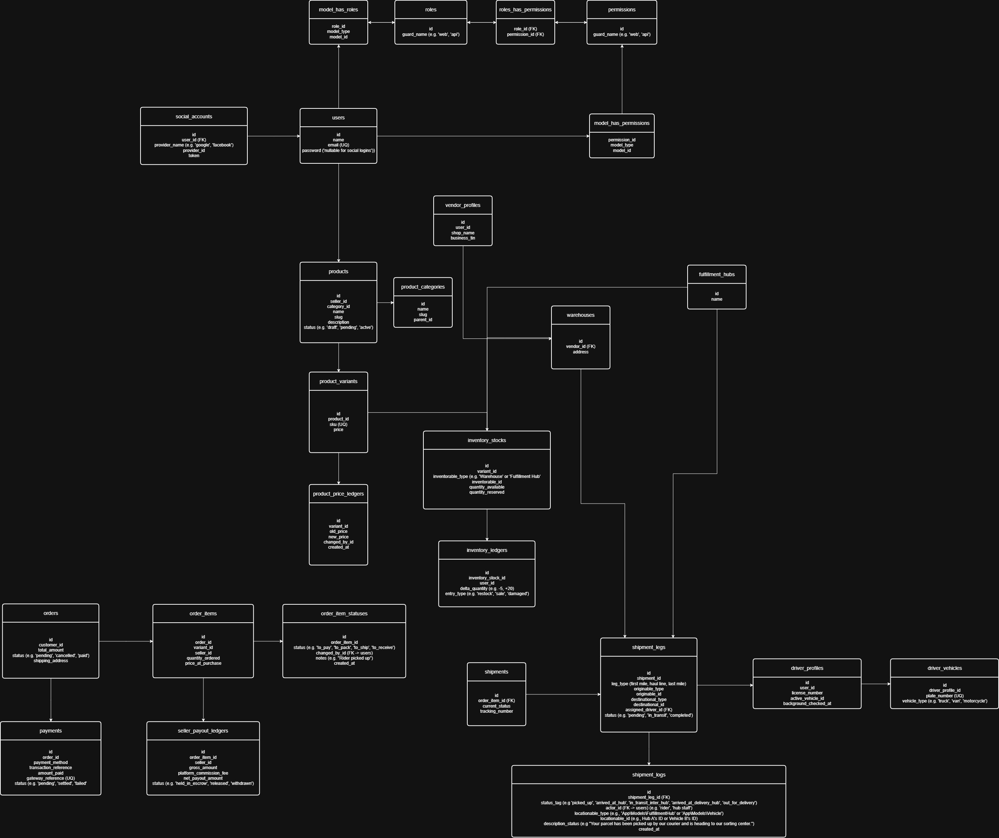

# Phase 2: System Design

## Tech Stack
- Frontend
- - NuxtJS
- Reverse Proxy
- - Nginx
- CDN
- - Cloudflare
- Backend
- - Laravel
- Caching
- - Redis
- Database
- - PostgreSQL
- Asynchronous Events
- - RabbitMQ (Message Queue)
- Background Worker
- - Go Routines
- Search Engine / Indexing Search
- - ElasticSearch
- Payment Gateway
- - Stripe, Paypal, Bank Cards, Crypto
- Mailer
- - SendGrid / AWS SES
- Storage
- - AWS S3
- Logs
- - FluentBit
- - Elasticsearch
- - Kibana
- Observability
- - Elastic APM

## [Database Schema ERD 1.0](https://drive.google.com/file/d/16iVNB2pAwcW6ndI78BE1bRuWoSL2JmGG/view?usp=sharing)
