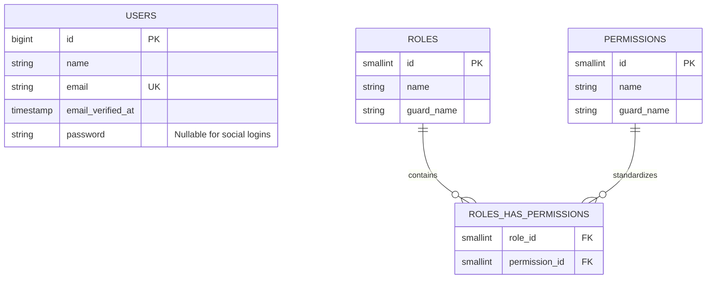
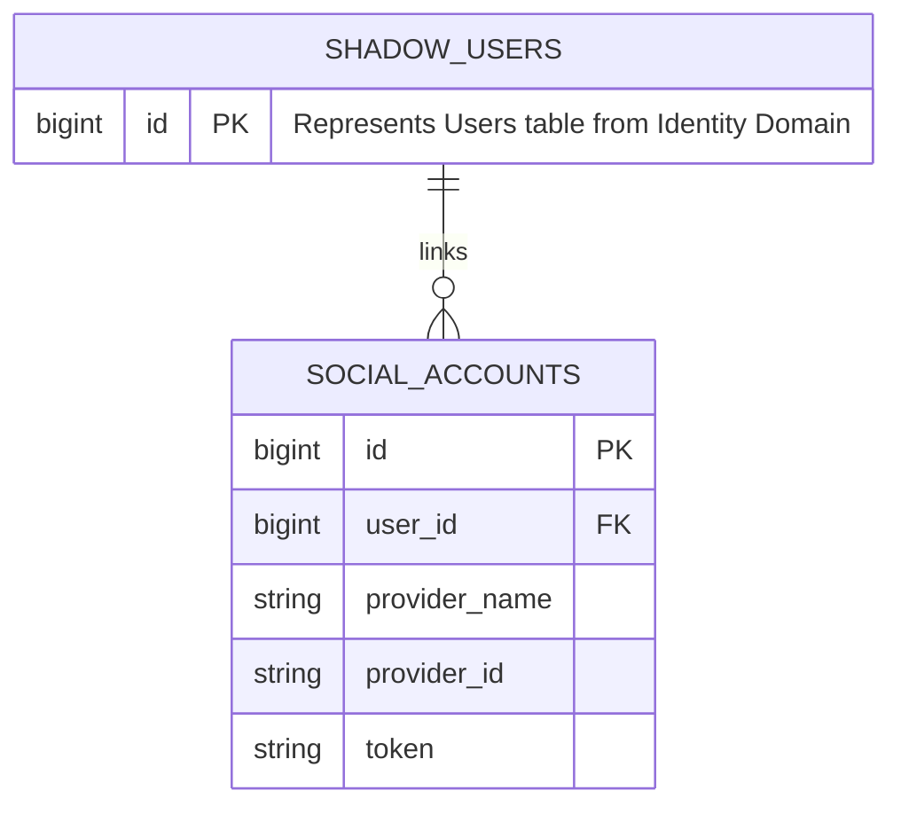
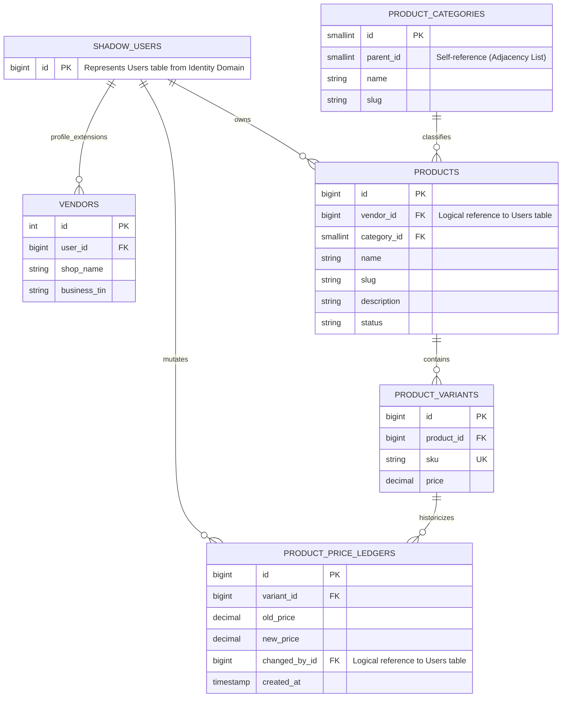
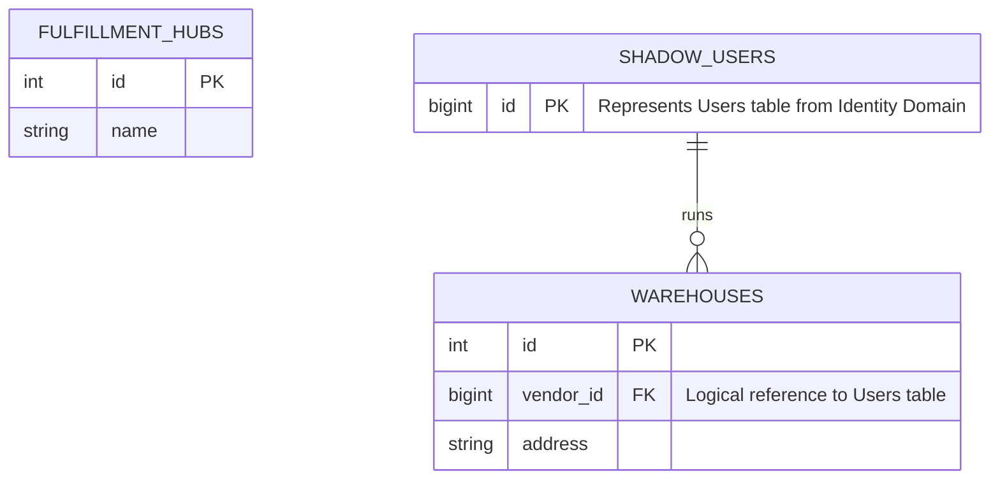
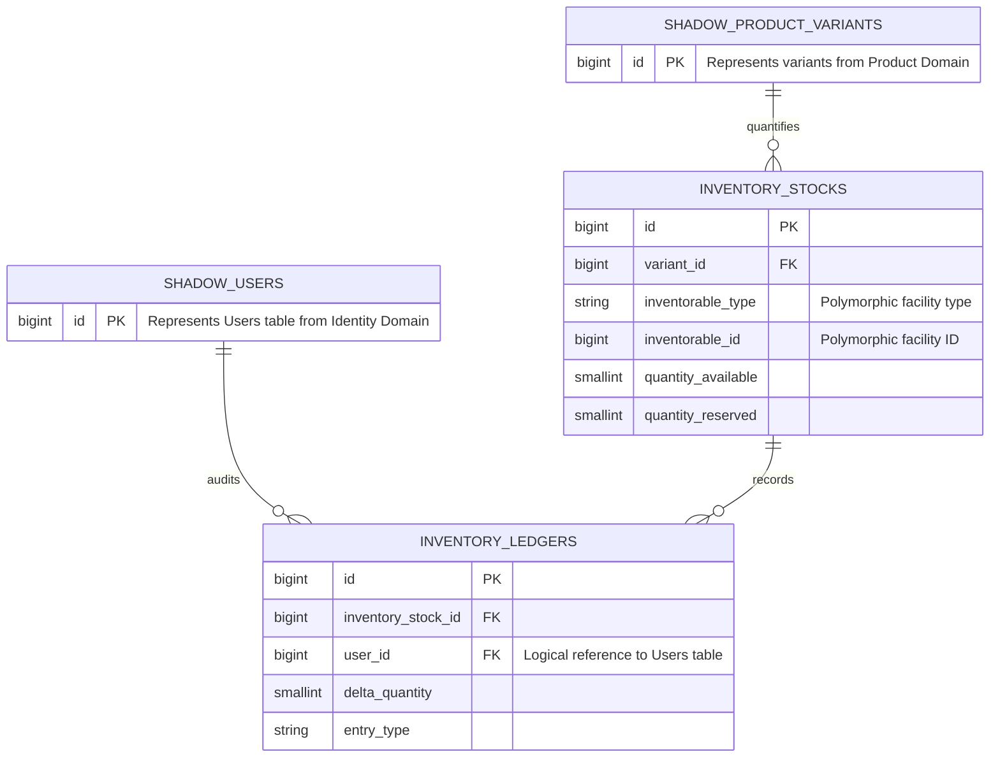
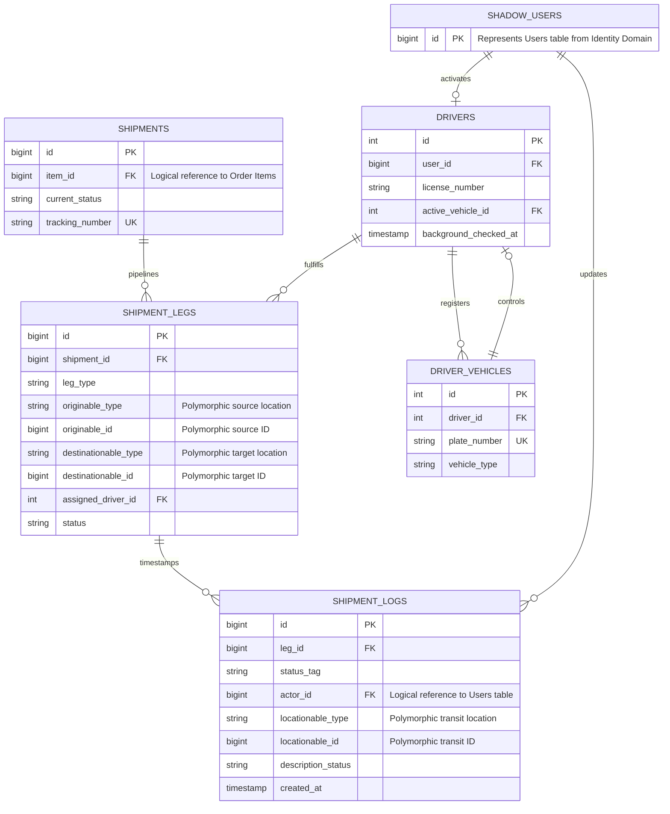

# 📊 Database Architecture & Specifications

This document defines the global persistence layout, relationship properties, and sub-domain structural boundaries governing the platform.

> 🔗 **[Open Interactive Master Canvas on dbdiagram.io](https://dbdiagram.io/d/ecommerce-6a70022b067336e1de479b34)**

> 🔗 **[Database Schema ERD 1.0](/docs/assets/ERD-1.0.svg)**
---

## 🧩 Segregated Domain Blueprints

### 1. Identity & RBAC Domain
This domain governs core authentication criteria, social credentials, and granular permission sets.

*Note: Polymorphic assignments (model_has_roles, model_has_permissions) are tracked at the application middleware layer to support dynamic cross-cutting authorization without enforcing rigid physical database-level constraints.*

### 2. Social Accounts Domain
This domain decouples third-party OAuth authentication tokens from the primary identity structures.

### 3. Products Domain
This domain handles vendor associations, hierarchical categories, product definitions, variations, and immutable price tracking logs.

### 4. Warehouse Domain
This domain manages dedicated merchant warehouses and platform-controlled fulfillment distribution centers.

### 5. Inventory Domain
This domain tracks stock levels and append-only entry logs across varying physical facilities using polymorphic routing.

### 6. Shipments Domain
This domain tracks multi-stage shipping legs, driver configurations, and real-time transit logs.

