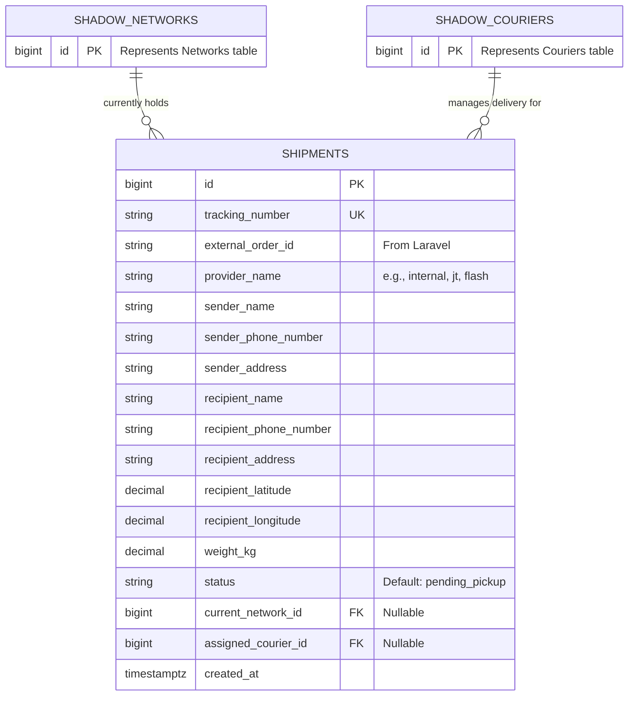
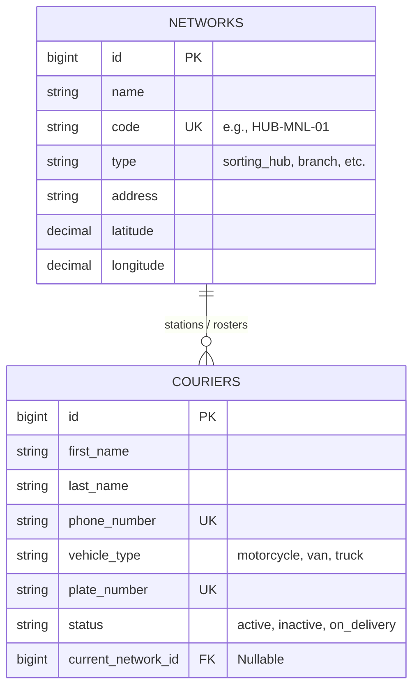
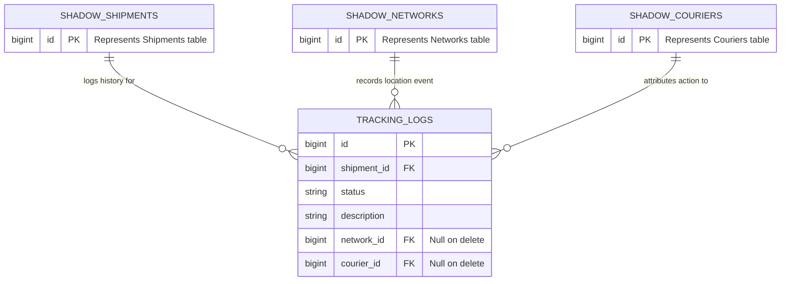

# 📊 Logistics Database Schema

> 🔗 **[Open Interactive Master Canvas on dbdiagram.io](https://dbdiagram.io/d/ecommerce-6a70022b067336e1de479b34)**

> 🔗 **[Logistics Database Schema ERD 1.0](/docs/assets/logistics-erd-1.0.png)**
---
## 🧩 Segregated Domain Blueprints

### 1. Core Transit & Shipment Domain
This domain manages the lifecycle of order packages ingested from external e-commerce systems, tracking their immediate state mutations and structural operational properties.

Note: current_network_id and assigned_courier_id remain entirely optional during early lifecycle phases (e.g., pending_pickup) to prevent database constraint errors prior to active fulfillment dispatching.

### 2. Network Nodes & Fleet Domain
This domain establishes physical geographic operations hubs alongside the asset management infrastructure governing couriers.

### 3. Historical Telemetry & Auditing Domain
This domain decouples chronological transit tracking, history capturing, and sequence auditing from active transaction processing engines.

