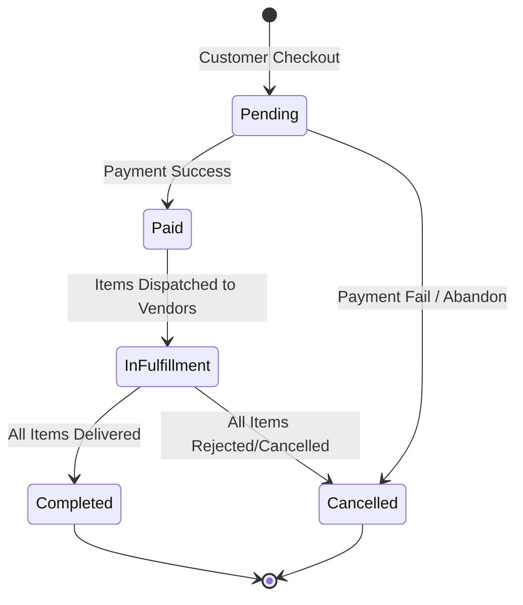
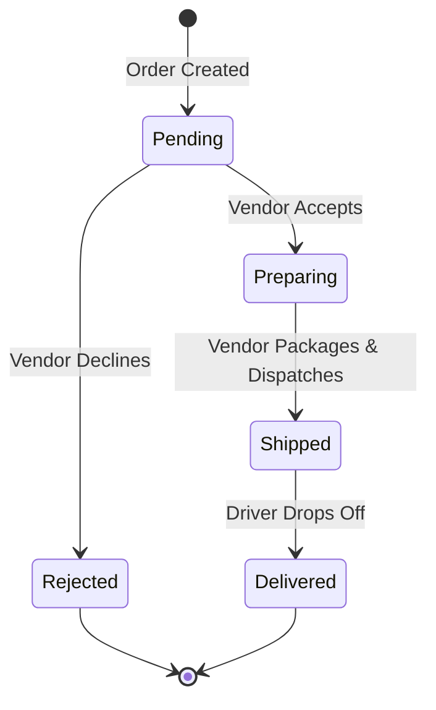
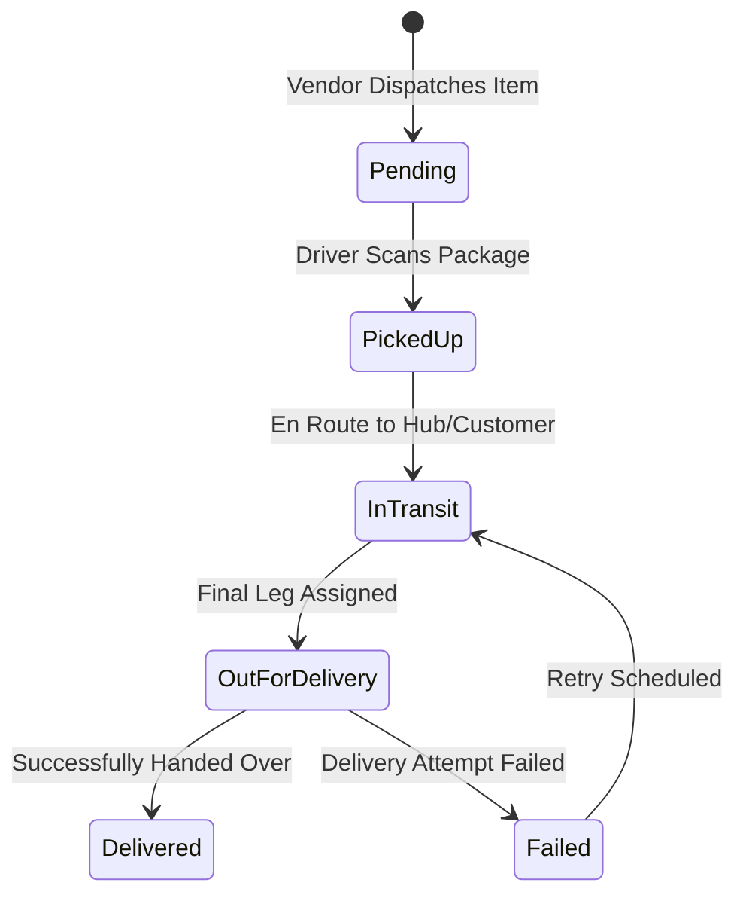

# 🔄 System State Machines & Domain Transitions

This document defines the official Macro (Order) and Micro (Item, Shipment, Payment) state machines for the e-commerce monorepo.

---

## 1. High-Level Macro/Micro State Mapping

| Entity | Level | Responsibility | Enum Class |
| :--- | :--- | :--- | :--- |
| **`Order`** | **Macro** | Overall customer order lifecycle | `App\Enums\OrderStatus` |
| **`OrderItem`** | **Micro** | Individual vendor item lifecycle | `App\Enums\OrderItemStatus` |
| **`Shipment`** | **Micro** | Logistics & driver delivery progress | `App\Enums\ShipmentStatus` |
| **`OrderPayment`** | **Micro** | Financial transaction status | `App\Enums\PaymentStatus` |

---

## 2. Macro State Machine: `Order`

### Order Transition Matrix

| From State | Allowed Target | Trigger / Action | Side Effects / Events | Actor |
| :--- | :--- | :--- | :--- | :--- |
| `pending` | `paid` | `payment.success` | Spawns `OrderPayment` (settled), creates seller ledgers | System / Gateway |
| `pending` | `cancelled` | `payment.failed` | Release cart holds | Customer / System |
| `paid` | `in_fulfillment` | `order.dispatched` | Notify respective Vendors | System |
| `in_fulfillment` | `completed` | All items `delivered` | Mark order complete, release vendor payouts | System |
| `in_fulfillment` | `cancelled` | All items `rejected` | Refund payment via gateway, update ledgers | System / Admin |

---

## 3. Micro State Machine: `OrderItem` (Vendor Domain)

### OrderItem Transition Matrix

| From State | Allowed Target | Trigger / Action | Side Effects / Events | Actor |
| :--- | :--- | :--- | :--- | :--- |
| `pending` | `preparing` | `vendor.accept` | Lock inventory stock | Vendor |
| `pending` | `rejected` | `vendor.reject` | Log reason, trigger partial refund, cancel ledger | Vendor |
| `preparing` | `shipped` | `vendor.ship` | **Create `Shipment` record with `TRK-` ID (#47)** | Vendor |
| `shipped` | `delivered` | `driver.complete` | Update `Shipment` to `delivered` | Driver |

---

## 4. Micro State Machine: `Shipment` (Logistics Domain - #47)

### Shipment Transition Matrix

| From State | Allowed Target | Trigger / Action | Side Effects | Actor |
| :--- | :--- | :--- | :--- | :--- |
| `pending` | `picked_up` | `driver.scan` | Assign driver ID | Driver |
| `picked_up` | `in_transit` | `transit.update` | Log GPS checkpoint / leg | Driver / Hub |
| `in_transit` | `out_for_delivery` | `driver.dispatch` | Send ETA push notification to customer | System |
| `out_for_delivery` | `delivered` | `driver.confirm` | Capture POD (Proof of Delivery), notify OrderItem | Driver |