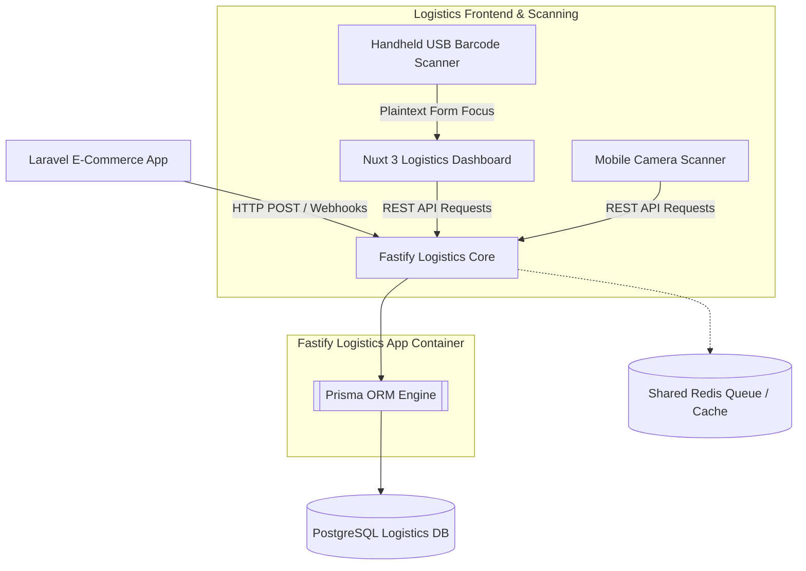

# 🚀 Multi-Courier Aggregator (Logistics Engine)

A high-throughput, low-latency asynchronous logistics engine designed to handle real-time parcel routing, multi-tier distribution networks (hubs, centers, branches), and rapid barcode scanning workflows for high-volume courier operations.

---

## 🎯 Core Features & System Engineering

This standalone logistics microservice addresses distributed delivery networks, leveraging high-performance asynchronous runtime architectures for real-time telemetry and cross-border package sorting.

### 🌐 Hub Infrastructure & Spatial Tracking
*   **Hierarchical Node Networks:** Strict relational modeling of spatial infrastructure routing tiers—Sorting Hubs, Distribution Centers, and Localized Branches—designed for complex package sortation workflows.
*   **Geospatial Audits:** Coordinates tracking via high-precision decimal mapping (latitude/longitude) for future spatial routing, vehicle optimization, and zone allocation.

### ⚡ Blazing-Fast Scanning & High-Throughput APIs
*   **Hardware & Smartphone Inbound Ingestion:** Optimized API endpoints designed to receive instantaneous string inputs parsed from Code 128 barcode scanners and courier application camera feeds.
*   **Asynchronous Sub-Millisecond I/O:** Powered by the Fastify asynchronous engine to handle thousands of concurrent check-in/check-out scans per second at sorting conveyor lines without thread-blocking latency.

### 💻 Reactive Logistics Portals
*   **Station Manager Dashboards:** A fast, reactive web interface built to handle continuous global layout scanning, inventory inbound queues, and fleet dispatch tracking.
*   **Real-Time Data Streams:** Implementation of seamless state handling and reactive pooling to update shipping counts, manifestos, and sorting statuses instantly as packages hit physical hubs.
### 🛵 Fleet Routing & Lifecycle Management
*   **Dynamic Asset Tracking:** Roster tracking of courier fleets, maintaining up-to-the-second records of Rider Status (active, on_delivery, break) and current localized branch associations.
*   **State Machine Shipments:** Robust transit lifecycle monitoring handling strict mutation steps from package induction (pending_pickup) through intermediate cross-docking legs to final fulfillment (delivered).

### 📜 Append-Only Auditing & Telemetry Logs
*   **Immutable Tracking Histories:** A decoupled, historical telemetry ledger capturing every single scanning touchpoint, hub arrival, and courier assignment change.
*   **Safe Relational Footprint:** Built with defensive SET NULL schema strategies to guarantee consumer-facing package histories remain fully viewable and uncorrupted, even if physical hubs decommission or riders leave the active roster.

---

## 🛠️ System Architecture & Tech Stack

---

## 🚀 Engineering Timeline & Process

This service handles the automated fulfillment lifecycles detached from the primary shopping logic, keeping tracking workloads completely decoupled from user browsing dependencies.

*   **[Logistics Database Architecture & Specifications](/docs/architecture/02-logistics-database-schema.md)**
    *   **Focus:** Segregated database designs mapping across Core Transit, Network Nodes, Fleet Registries, and Historical Telemetry sub-domains.